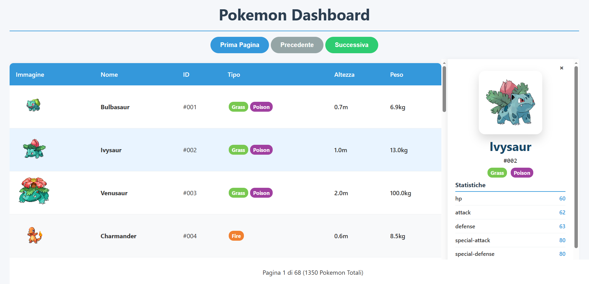

# 📌 Pokemon Dashboard

Progetto finale realizzato al termine del corso **Javascript**.  
In questo progetto ho applicato le principali competenze acquisite durante il corso, mettendo in pratica concetti teorici e tecnici attraverso un caso concreto.

Il progetto prevede la realizzazione di una Pokemon dashboard che recupera i dati tramite API e li visualizza in una tabella con paginazione (ogni pagina contiene 20 elementi). Al click di ogni elemento della tabella viene visualizzato un side panel che mostra ulteriori informazioni relative al pokemon selezionato. 

---

## 🎓 Corso Javascript

Il corso Javascript seguito è un corso gratuito online che tratta le basi del linguaggio di programmazione Javascript.

🔗 **Link al corso:**  
[Corso Javascript - Edoardo Midali](https://www.youtube.com/playlist?list=PLP5MAKLy8lP-vFVhhTI7fwN39MRtoKTrP)

---

## 📸 Screenshot del progetto

---

## 👤 Autore

- Martina Genovese  
- GitHub: [https://github.com/MMarty11](https://github.com/MMarty11)
